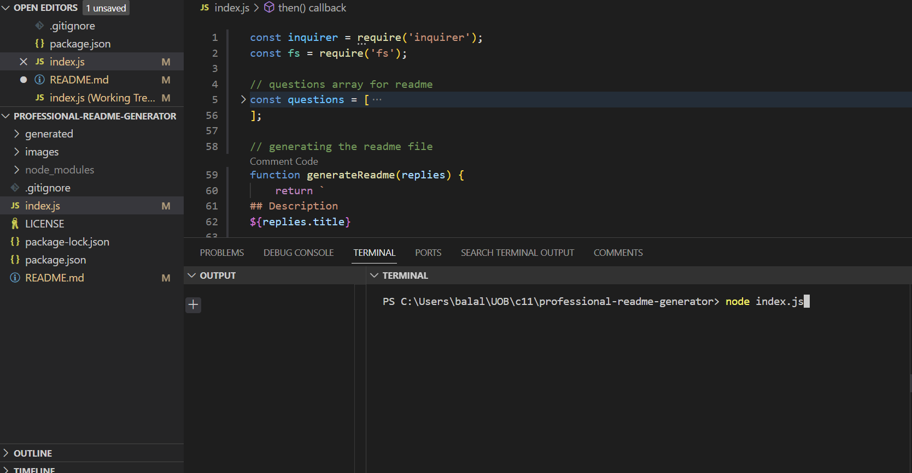
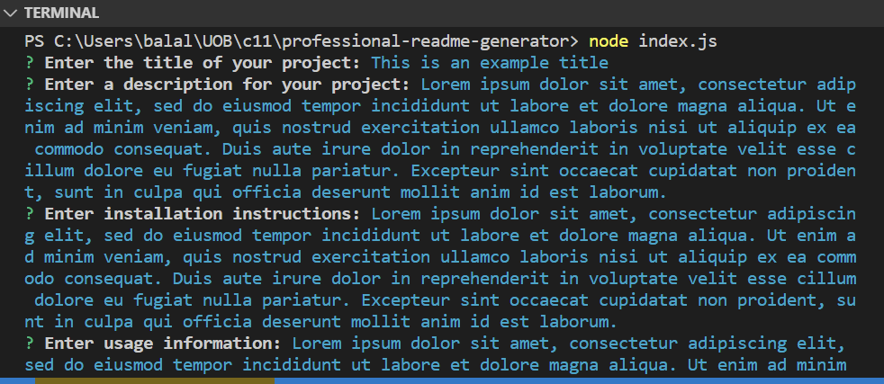
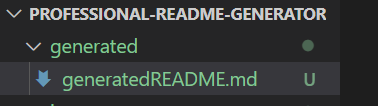
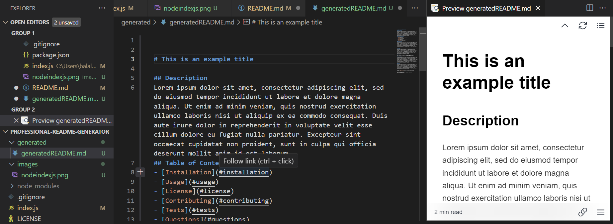

# Professional README Generator

- I have created a README generator, for the sake of being able to have this README file and another generated file, i have created a folder called generated and a file which is created in here called generatedREADME

- A question array is used which takes in input from the terminal when you run the index.js file using 'node index.js'.

- This application is designed to help developers create effective and professional README file for their GitHub repositories. This application is a command-line application that dynamically generates a professional README file from user input using the Inquirer npm package.

## Images

This image shows running the node index.js file in the terminal.

Here is an image during entering text.

Here is an image of a generated README file in the generated folder.

Here is an image of the generated README file.

## Video tutorial

Please refer to the video tutorial using the following link:

## Links

- [Link for repository](https://github.com/balalsaleh/professional-readme-generator)

- [Loom video tutorial](https://www.loom.com/share/c712473186ae4f938bc2fffb18d9ff4e)
